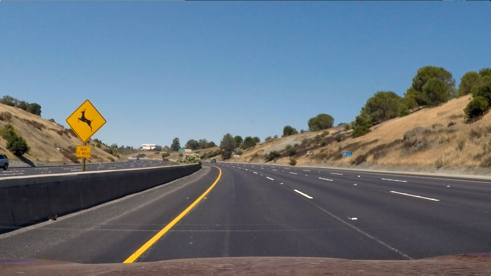
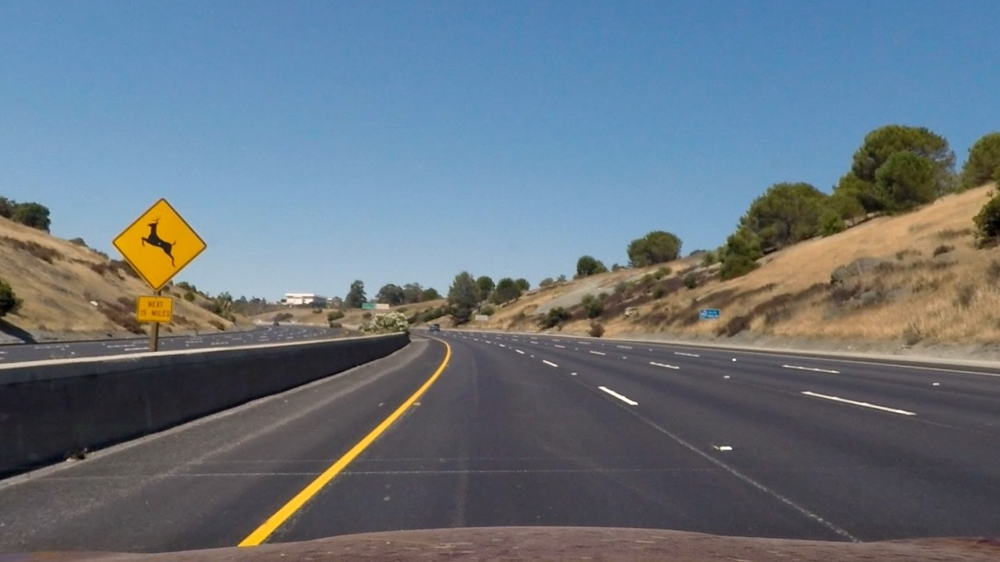
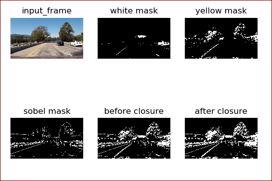
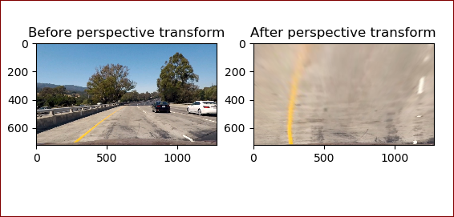
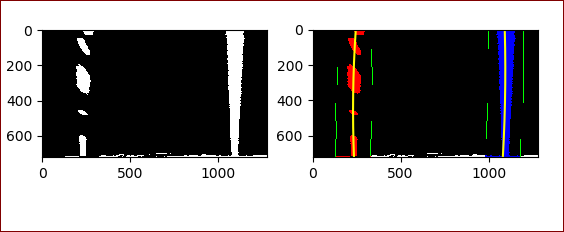
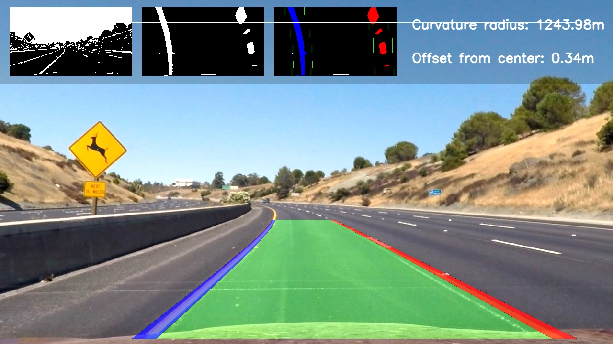

## Advanced Lane Finding

In this project, your goal is to write a software pipeline to identify the lane boundaries in a video, but the main output or product we want you to create is a detailed writeup of the project.  Check out the [writeup template](https://github.com/udacity/CarND-Advanced-Lane-Lines/blob/master/writeup_template.md) for this project and use it as a starting point for creating your own writeup.  

### Camera Calibration

OpenCV provide some really helpful built-in functions for the task on camera calibration. First of all, to detect the calibration pattern in the [calibration images](./camera_cal/), we can use the function `cv2.findChessboardCorners(image, pattern_size)`. 

Once we have stored the correspondeces between 3D world and 2D image points for a bunch of images, we can proceed to actually calibrate the camera through `cv2.calibrateCamera()`. Among other things, this function returns both the *camera matrix* and the *distortion coefficients*, which we can use to undistort the frames.

The code for this steps can be found in `Project2_1.py`.   

I applied this distortion correction to the test image using the `cv2.undistort()` function and obtained the following result

<table style="width:100%">
  <tr>
    <th>
      

           
            Chessboard image before calibration
      

    </th>
    <th>
      

           
            Chessboard image after calibration
      

    </th>
  </tr>
</table>

### Pipeline (single images)

#### 1. Provide an example of a distortion-corrected image.

Once the camera is calibrated, we can use the camera matrix and distortion coefficients we found to undistort also the test images. Indeed, if we want to study the *geometry* of the road, we have to be sure that the images we're processing do not present distortions. Here's the result of distortion-correction on one of the test images:

<table style="width:100%">
  <tr>
    <th>
      

           
            Test image before calibration
      

    </th>
    <th>
      

           
            Test image after calibration
      

    </th>
  </tr>
</table>

#### 2. Describe how (and identify where in your code) you used color transforms, gradients or other methods to create a thresholded binary image.  Provide an example of a binary image result.

Correctly creating the binary image from the input frame is the very first step of the whole pipeline that will lead us to detect the lane. For this reason, I found that is also one of the most important. If the binary image is bad, it's very difficult to recover and to obtain good results in the successive steps of the pipeline. The code related to this part can be found (`Project2_2.py`).

Below are the  combination of color and gradient thresholds used to generate a binary image. 

1-For detecting white lines, I found that [equalizing the histogram](http://docs.opencv.org/3.1.0/d5/daf/tutorial_py_histogram_equalization.html) of the input frame before thresholding works really well to highlight the actual lane lines. 
2-For detecting the yellow lines, I used a threshold on V channel in [HSV](http://docs.opencv.org/3.2.0/df/d9d/tutorial_py_colorspaces.html) color space.
3- Used Sobel kernel to get an estimate of the gradients of the lines. 
4- Finally onvert an input frame to a binary image which highlight as most as possible the lane-lines.

  

#### 3. Describe how (and identify where in your code) you performed a perspective transform and provide an example of a transformed image.

For warping between the two perspective can be found [here](./Project2_3.py). 

The function `Project2_3.birdeye()` takes as input the frame (either color or binary) and returns the bird's-eye view of the scene. In order to perform the perspective warping, we need to map 4 points in the original space and 4 points in the warped space. For this purpose, both source and destination points are *hardcoded* (ok, I said it) as follows:

Below is the exmaple of perspective output

  

#### 4. Describe how (and identify where in your code) you identified lane-line pixels and fit their positions with a polynomial?

To identify which pixels of a given binary image belong to lane-lines, we have (at least) two possibilities. If we have a brand new frame, and we never identified where the lane-lines are, we must perform an exhaustive search on the frame. This search is implemented in `Lanes.getFitsBySlidingWindows()`: starting from the bottom of the image, precisely from the peaks location of the histogram of the binary image, we slide two windows towards the upper side of the image, deciding which pixels belong to which lane-line.

On other hand, if we're processing a video and we confidently identified lane-lines on the previous frame, we can limit our search in the neiborhood of the lane-lines we detected before: after all we're going at 30fps, so the lines won't be so far, right? This second approach is implemented in `Lanes.getFitsByPreviousFits()`. In order to keep track of detected lines across successive frames.

The qualitative result of this phase is shown here:

  

#### 5. Describe how (and identify where in your code) you calculated the radius of curvature of the lane and the position of the vehicle with respect to center.

Offset from center of the lane is computed in `compute_offset_from_center()` as one of the step of the procecssing pipeline defined in [`Project_Final.py`](./Project_Final.py).

For previous lane-line detection phase, a 2nd order polynomial is fitted to each lane-line using `np.polyfit()`. This function returns the 3 coefficients that describe the curve, namely the coefficients of both the 2nd and 1st order terms plus the bias. From this coefficients, following [this](http://www.intmath.com/applications-differentiation/8-radius-curvature.php) equation, we can compute the radius of curvature of the curve. From an implementation standpoint, I decided to move this methods as properties of `Lanes` class.

#### 6. Provide an example image of your result plotted back down onto the road such that the lane area is identified clearly.

     
      Qualitative result for test2.jpg

All other test images can be found in [./output_images/](./output_images/)

Final Video is out_project_10

#### 1. Briefly discuss any problems / issues you faced in your implementation of this project.  Where will your pipeline likely fail?  What could you do to make it more robust?

The whole solution is not working for other videos. its required more trained model to calculate correct path using deep learning.

## How to write a README
A well written README file can enhance your project and portfolio.  Develop your abilities to create professional README files by completing [this free course](https://www.udacity.com/course/writing-readmes--ud777).

